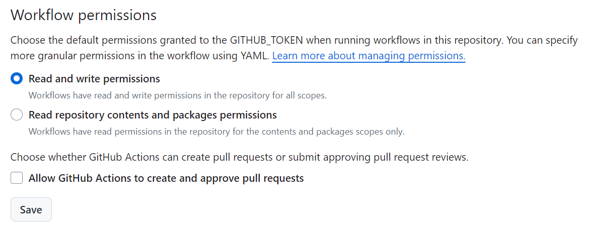

# Scheduled task 🕒

This is a community version of scheduled task, a service from MathWorks aiming at scheduling data analysis, simulation and AI model training.


**Resources:**

-  [Continuous Integration with MATLAB® and GitHub® Actions Workshop](https://github.com/mathworks/ci-with-matlab-and-github-actions-workshop) 
-  [How to Run MATLAB in GitHub Actions \- Youtube](https://www.youtube.com/watch?v=Ndp5kBhOXq4)  
-  [Using MATLAB with GitHub Actions \- Youtube](https://www.youtube.com/watch?v=Qj5upV0Qm1o)  
-  [Learn GitHub Actions](https://docs.github.com/en/actions/learn-github-actions)  
-  [Flat Data](https://githubnext.com/projects/flat-data)  
<a name="beginToc"></a>

## Table of Contents:
[Architecture](#architecture)
 
[Create your first task](#create-your-first-task)
 
[Schedule your task execution](#schedule-your-task-execution)
 
[Document your work](#document-your-work)
 
<a name="endToc"></a>

# Architecture

In your repository, create the `.github/workflows/` directory to store your workflow files.

```matlab
mkdir .github/workflows/
mkdir Tasks
mkdir Data
```

# Create your first task

The basic example will be checking [Bitcoin prices daily](https://docs.cloud.coinbase.com/sign-in-with-coinbase/docs/api-prices), and storing it into a new row of an existing csv file.


**First iteration** of the task executed locally and interactively:

```matlab
jason = webread("https://api.coinbase.com/v2/prices/BTC-USD/spot")
```

```matlabTextOutput
jason = struct with fields:
    data: [1x1 struct]

```

```matlab
T = struct2table(jason.data)
```
| |amount|base|currency|
|:--:|:--:|:--:|:--:|
|1|63300.09|BTC|USD|

```matlab
T.time = datetime("now")
```
| |amount|base|currency|time|
|:--:|:--:|:--:|:--:|:--:|
|1|63300.09|BTC|USD|26-Apr-2024 12:08:59|

```matlab
writetable(T,'Data/btc.csv')
```

**Second iteration**: Simply read the existing dataset as a timetable and [add a row](https://www.mathworks.com/help/matlab/matlab_prog/add-and-delete-table-rows.html)

```matlab
% Read input data
T = readtable("Data/btc.csv");
jason = webread("https://api.coinbase.com/v2/prices/BTC-USD/spot");
Tnew = struct2table(jason.data);
Tnew.time = datetime("now");
%  Transform data to fit the input format
Tnew.amount = double(string(Tnew.amount));
Tnew.base = cellstr(Tnew.base);
Tnew.currency = cellstr(Tnew.currency);
T = [T;Tnew] % adding a row
```
| |amount|base|currency|time|
|:--:|:--:|:--:|:--:|:--:|
|1|6.3300e+04|'BTC'|'USD'|26-Apr-2024 12:08:59|
|2|6.3404e+04|'BTC'|'USD'|26-Apr-2024 12:09:48|

```matlab
% Write output data
writetable(T,'Data/btc.csv')
```

Save this calculation into a script to run daily: 

```matlab
edit Tasks/task1.m
```

# Schedule your task execution

In the `.github/workflows/` directory, create a new file called `task.yml` and add the following code.

```matlab
edit .github/workflows/task.yml
```
```
name: MATLAB task
run-name: ${{ github.actor }} is scheduling a MATLAB task
on: 
  # schedule:
  #   - cron: "*/5 * * * *"
  workflow_dispatch: {}

jobs:
  task:
    runs-on: ubuntu-latest
    steps:
      # Checks-out your repository under $GITHUB_WORKSPACE, so your job can access it
      - uses: actions/checkout@v4
      
      # Sets up MATLAB on a GitHub-hosted runner
      - name: Set up MATLAB
        uses: matlab-actions/setup-matlab@v2

      # You can use "run-command" to execute custom MATLAB scripts, functions, or statements
      - name: Run custom testing procedure
        uses: matlab-actions/run-command@v2
        with:
          command: disp('Running my task!'); addpath('Tasks'); task1;

      # Commit and push the result of the MATLAB task
      - name: Commit and push changes
        run: |
          date > last-run.txt
          git config user.name github-actions
          git config user.email github-actions@github.com
          git add .
          git commit -m "generated"
          git push

      # Save the result as artifact
      - name: Archive output data
        uses: actions/upload-artifact@v4
        with:
          name: bitcoin-price-history
          path: Data/btc.csv
```

This will run the [task1.m](./Tasks/task1.m) on a specific [schedule](https://docs.github.com/en/actions/using-workflows/events-that-trigger-workflows#schedule), here [every 5 minutes](https://crontab.guru/every-5-minutes)


This follows the cron syntax:

```
# ┌───────────── minute (0–59)
# │ ┌───────────── hour (0–23)
# │ │ ┌───────────── day of the month (1–31)
# │ │ │ ┌───────────── month (1–12)
# │ │ │ │ ┌───────────── day of the week (0–6) (Sunday to Saturday;
# │ │ │ │ │                                   7 is also Sunday on some systems)
# │ │ │ │ │
# │ │ │ │ │
# * * * * * <command to execute>

```

We are also adding a [workflow\_dispatch](https://docs.github.com/en/actions/using-workflows/manually-running-a-workflow) to enable a manual execution of the workflow in the actions tab:


Save the result of the task by pushing back the changes. For this ensure that you give Read and write permissions to the workflow in `Settings/Actions`




# Document your work
```matlab
export("GettingStarted.mlx", "README.md");
```
